<h1>Mapster3D</h1>
<h2>Build a tiny city in 3D.</h2>

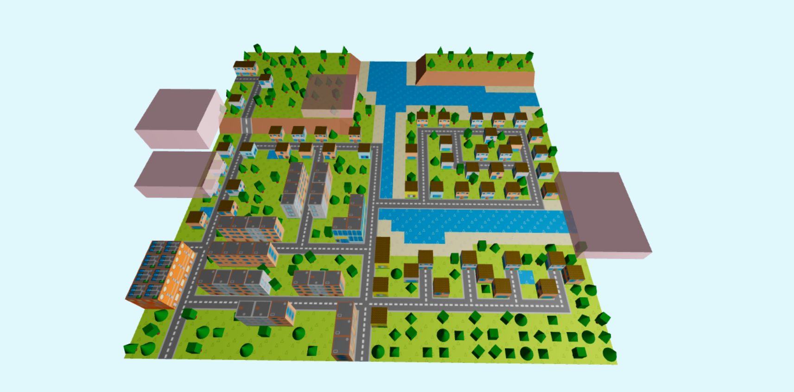

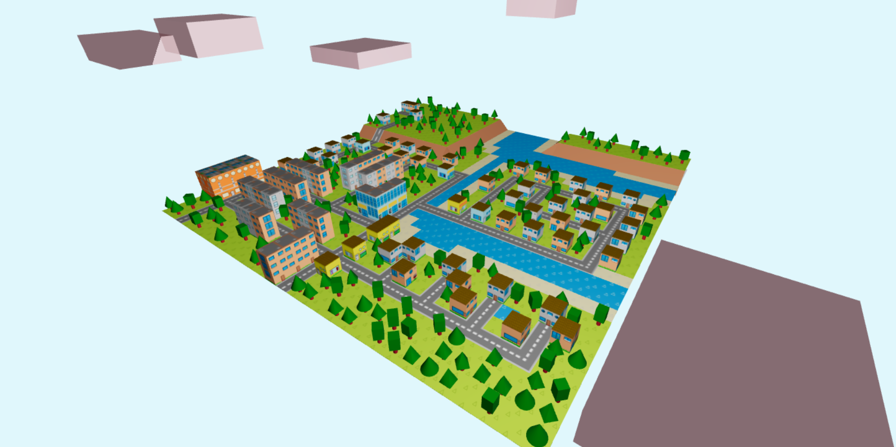

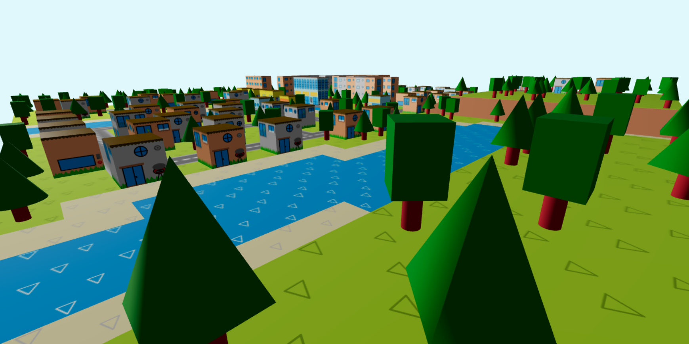

<a href="https://mapster3d.vercel.app">Play v0.1 HERE</a>

Based on another project of mine from 2 years ago (https://github.com/PerlMonker303/Mapster).

<b>Features (v0.1)</b>
<ul>
<li>Automatic road alignment system</li>
<li>Add zones to your roads (residential, commercial, industrial)</li>
<li>Watch your buildings take to the skies while you build or upgrade them</li>
<li>Save and load your creations</li>
<li>Build a functional sewage system</li>
<li>Watch your population grow</li>
<li>Manage your funds properly</li>
<li>Pause or speed up the time</li>
<li>Elevate the ground around your city (experimental)</li>
</ul>

<h2>Screenshots</h2>
<h3>07.02.2021</h3>

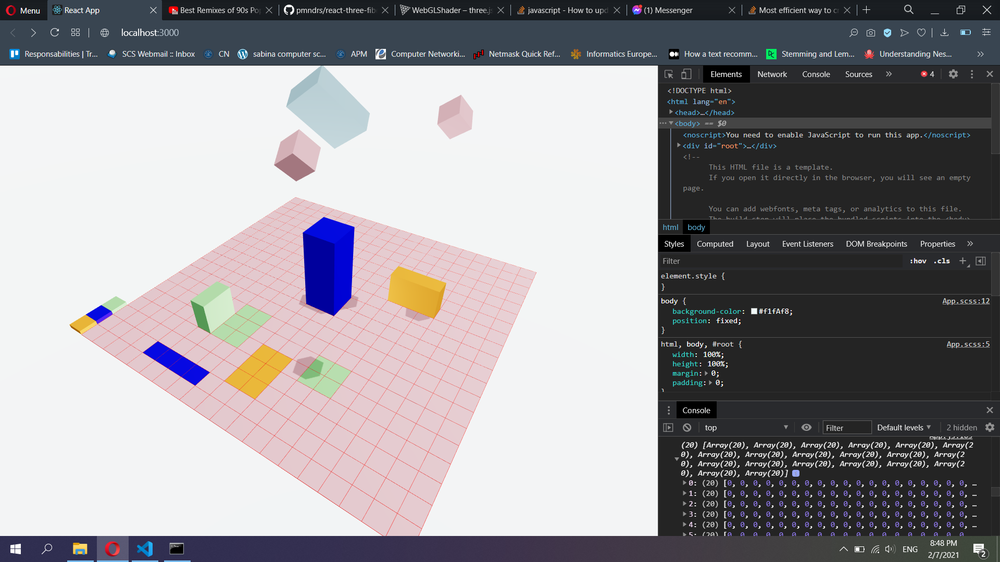

<h3>08.02.2021</h3>

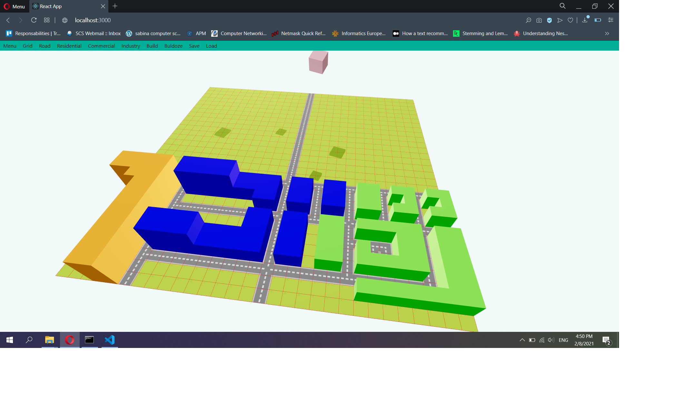

<h3>09.02.2021</h3>

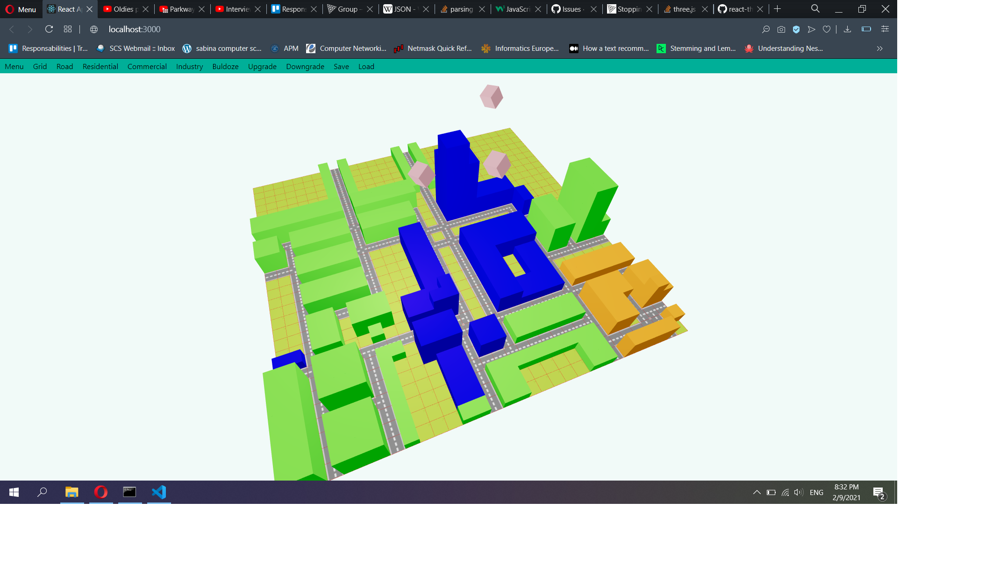

<h3>10.02.2021</h3>

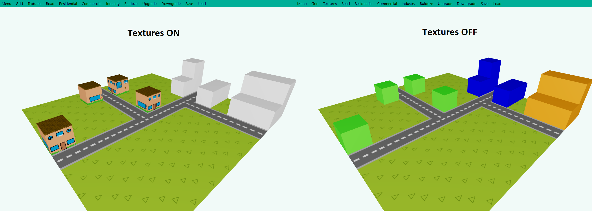

<h3>11.02.2021</h3>

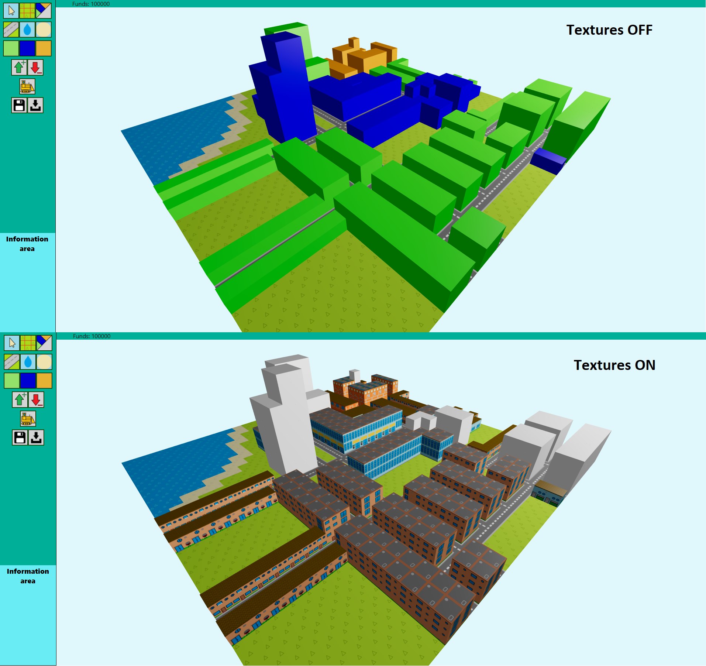

<h3>12.02.2021</h3>

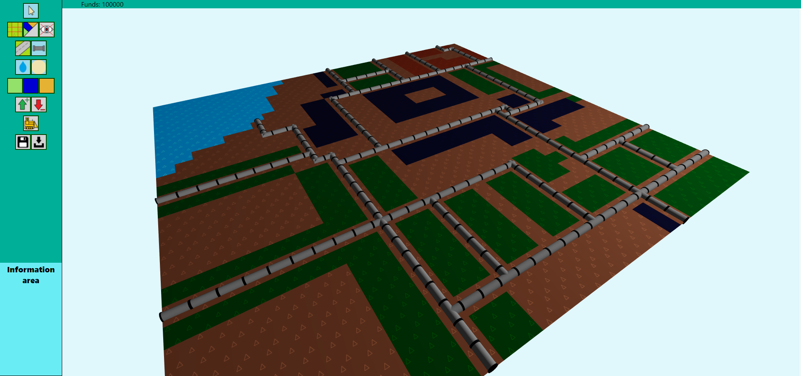

<h3>14.02.2021</h3>

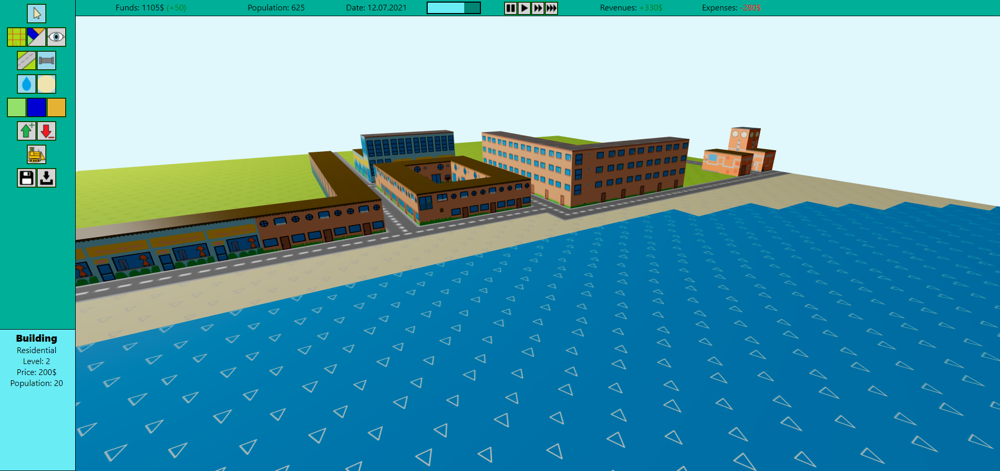

<h3>15.02.2021</h3>

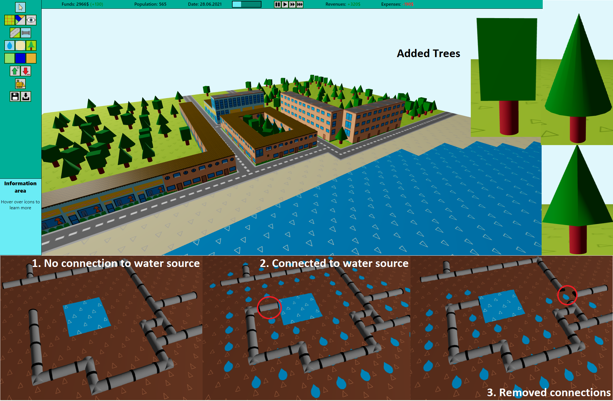

<h3>18.02.2021</h3>

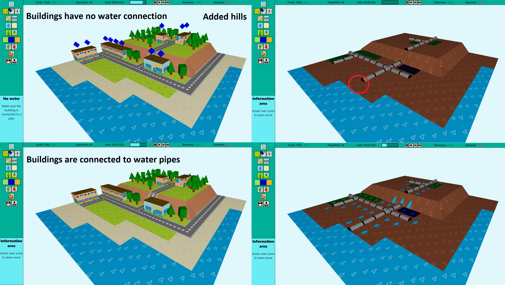

<h3>20.02.2021</h3>

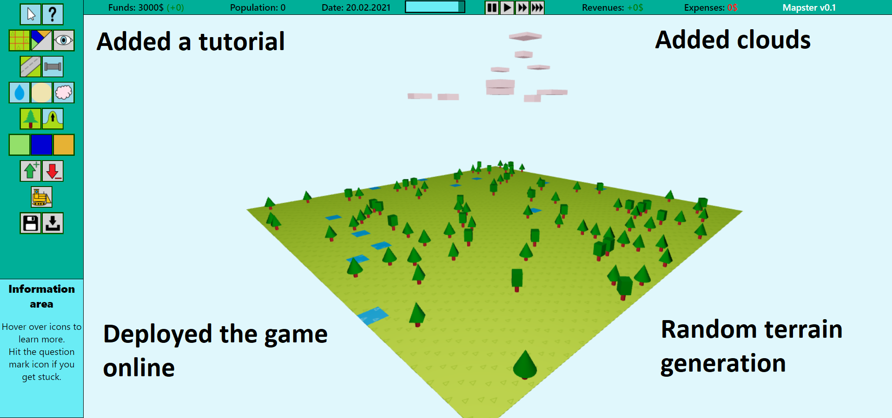