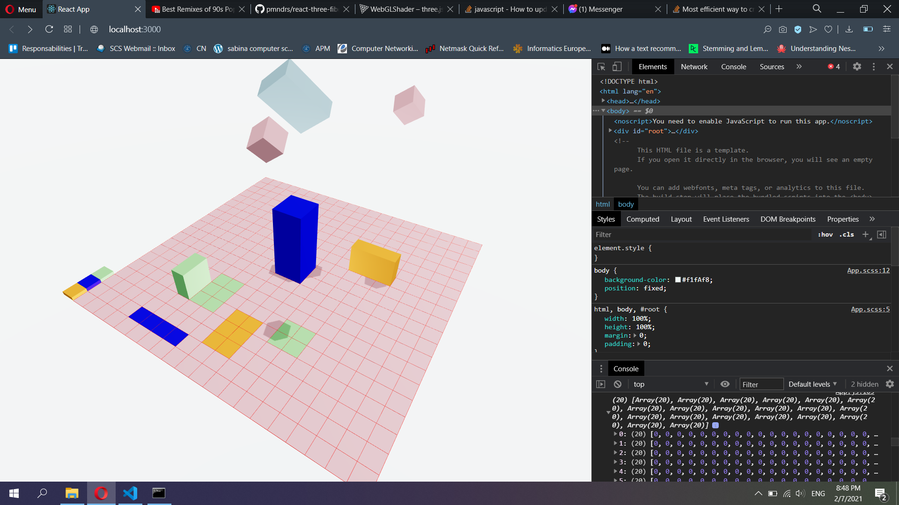
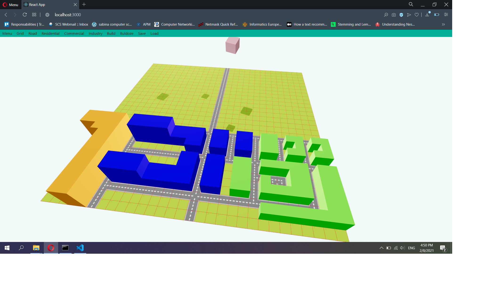
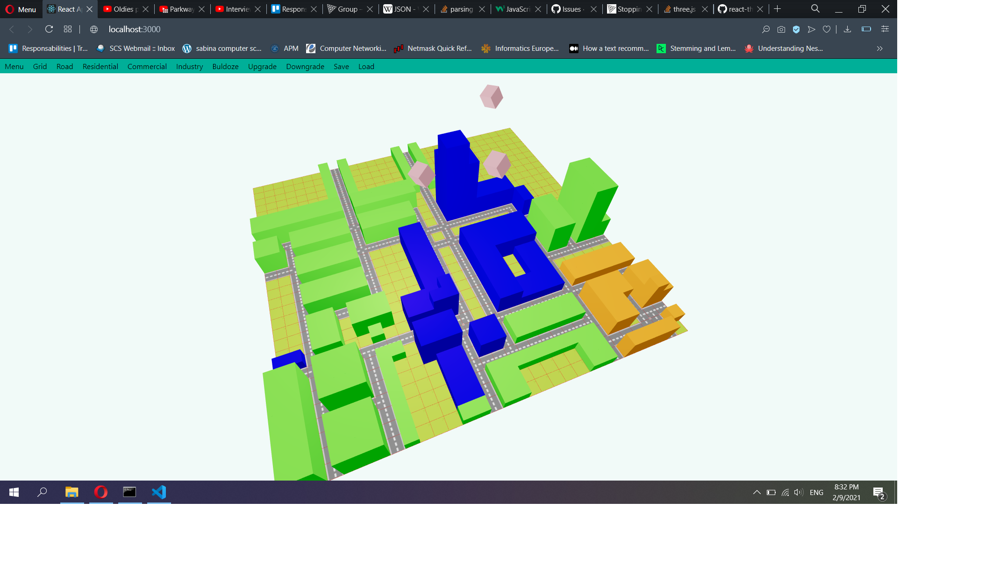
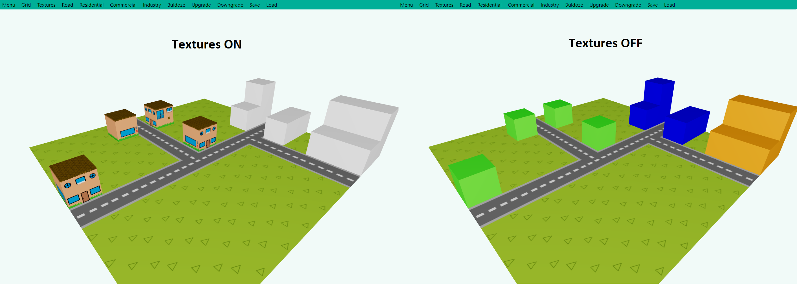
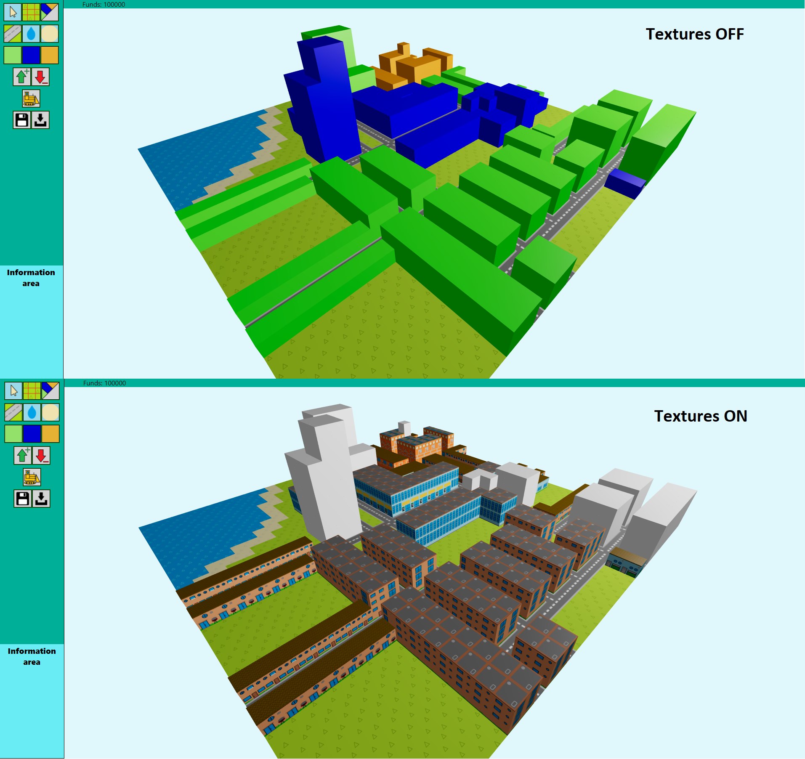
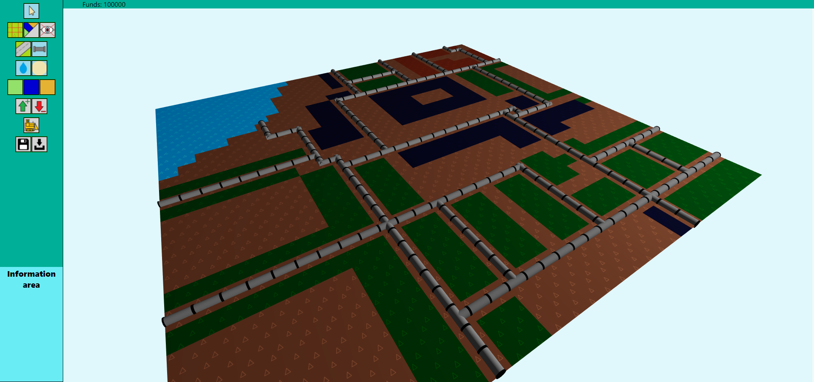
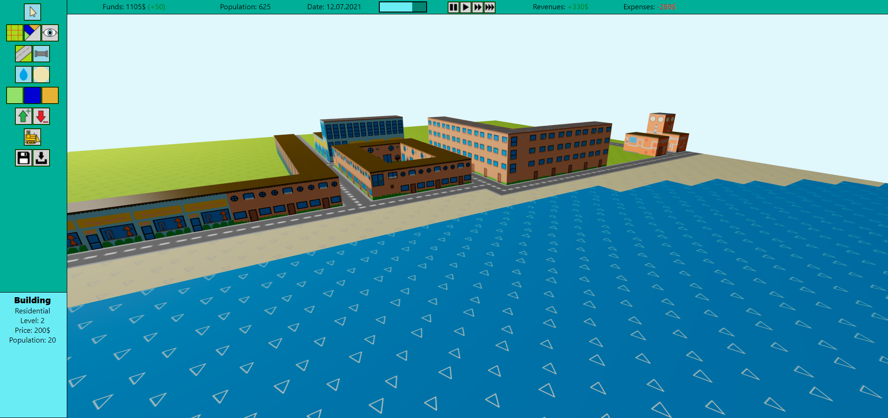

<h1>Mapster3D</h1>
<h2>Build a tiny city in 3D.</h2>

Based on another project of mine from 2 years ago (https://github.com/PerlMonker303/Mapster).

<b>Features</b>
<ul>
<li>Automatic road alignment system</li>
<li>Add zones to your roads (residential, commercial, industrial)</li>
<li>Watch your buildings take to the skies</li>
<li>Save and load your creations</li>
<li>Upgrade or downgrade buildings</li>
<li>Watch your population grow</li>
<li>Manage your funds properly</li>
<li>Stop or speed up the time</li>
</ul>

<h2>Screenshots (WORK IN PROGRESS)</h2>
<h3>07.02.2021</h3>

<h3>08.02.2021</h3>

<h3>09.02.2021</h3>

<h3>10.02.2021</h3>

<h3>11.02.2021</h3>

<h3>12.02.2021</h3>

<h3>14.02.2021</h3>

